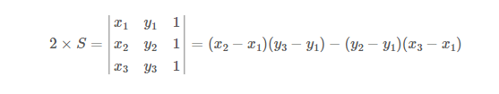

#### 외적 알고리즘 구현


```
dot = []
for i in range(3):
    dot.append(list(map(int, input().split())))

def ccw(p1, p2, p3):
    x1, y1 = p1
    x2, y2 = p2
    x3, y3 = p3
    return (x1 * y2 + x2 * y3 + x3 * y1) - (x2 * y1 + x3 * y2 + x1 * y3)

result = ccw(dot[0], dot[1], dot[2])
if result > 0:
    print(1)
elif result < 0:
    print(-1)
else:
    print(0)
```


참고링크: [백준 11758 파이썬 python : CCW @@황소처럼 우직하게@@ 꼭 알아야되는 기본 알고리즘 (tistory.com)](https://hjp845.tistory.com/172)


세 점으로 이루어진 삼각형의 면적을 구하는 방법을 이용해서 방향성을 구할 수 있습니다. �$S$ 를 점 P1, P2, P3로 이루어진 삼각형의 면적이라고 했을 때



입니다.

여기서 S의 부호에 따라서, 다음과 같이 세 가지로 나눌 수 있습니다.

- S > 0: 반시계 방향
- S = 0: 일직선
- S < 0: 시계 방향

코드로 나타내면 아래와 같습니다.

```
int ccw(int x1, int y1, int x2, int y2, int x3, int y3) {
    int temp = x1*y2+x2*y3+x3*y1;
    temp = temp - y1*x2-y2*x3-y3*x1;
    if (temp > 0) {
        return 1;
    } else if (temp < 0) {
        return -1;
    } else {
        return 0;
    }
}
```


참고링크: [점 3개의 방향성을 나타내는 CCW (acmicpc.net)](https://www.acmicpc.net/blog/view/27)