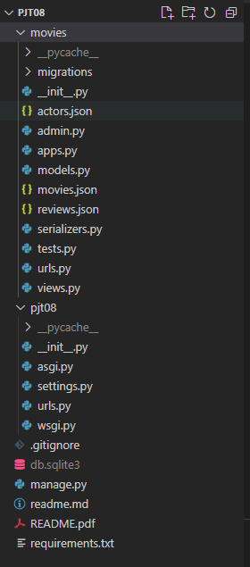
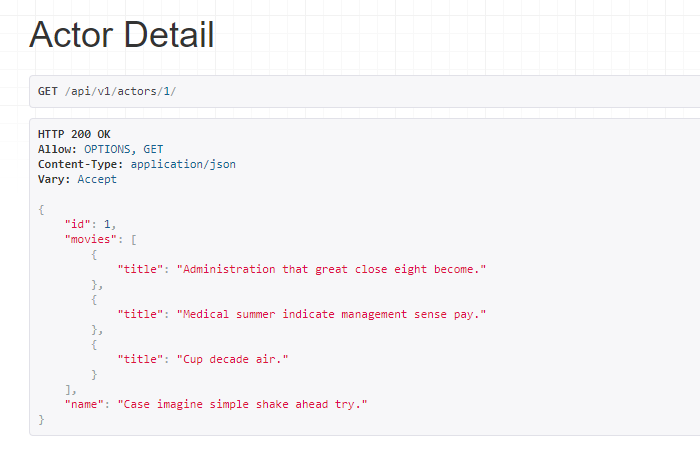
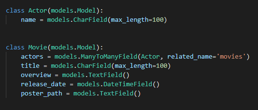
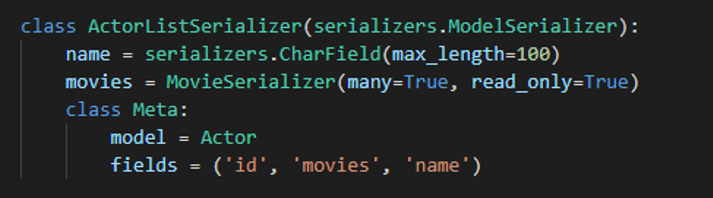

220422 Pair Project TIL


#### 1. 주어진 fixture data를 load할 때 json 파일 위치 참고



```
$ python manage.py migrate

$ python manage.py loaddata movies/actors.json movies/movies.json movies/reviews.json
```


#### 2. models.py와 serializers.py



=> 명세서에서 원하는 응답 형식 확인

=> "id", "movies", "name"        # "movies"는 다른 serializer 참조, "id"는 기본 장착




=> ```ManyToMantField```는 다대다 관계를 의미. 관련 테이블 생김. Actor 클래스에 ```movies = models.ManyToManyField(Movie, related_name='actors')``` 로 써도 무방.


=> Movie 모델에서 title만 뽑겠다는 뜻. title 최대 길이는 100으로 설정.




=> Actor 모델에서 id(기본 장착), movies(manytomanyfield로 사용 가능하게 됨), name(model에서 직접 만든 필드)

=> name은 최대 100자로 설정. 명세서에 보이듯이 movies는 title이라는 추가 정보를 담아와야되기 때문에 MovieSerializer을 거쳐서 title이 함께 출력되도록 설정.

=> The End.


* serializer은 위에서부터 읽어내려오기 때문에 주의하여 코드 작성하기.


Pair Project readme

배운 점

* ```git add .``` 이후 아무 동작이 없을 시 gitignore 가 없는 것!
* serializer 안 읽힐 때도 있으니 visual studio 재접속으로 해결!
* serializer 코드를 짤 때 field에서 하나의 데이터만 받고 싶으면 뒤에 쉼표를 붙여야 에러가 안남!

```python
    class Meta:
        model = Actor
        fields = ('name',)
```


느낀 점

* ~~님과 serializers.py 코드를 같이 고민하며 문제를 해결했을 때 즐거웠다.
* ~~님께서 나보다 Django를 잘 다루셨는데 학습 상태(?)가 아주 많이 차이나는 것 같지 않아서 조금 더 부담없이, 재밌게, 단방향이 아닌 양방향으로 배워나갈 수 있어서 좋았다.
* 앞으로 serializers.py 코드를 짤 때는 조금 더 자신감 있게 가능할 거 같다.
* 코드를 짜다가 모르는 게 생기면 그때그때 물어보며 공부를 하는게 더 재밌고 집중이 잘 되었다.
* ㅇㅇ님과 ㅁㅁ님의 방에 가서 궁금한 것 질문을 했었는데 해결책을 다 알고 계셔서 신기했고 많은 도움이 되었다.


부족한 점

* views.py 코드에 대한 이해가 아직 부족하지만 많이 친숙해짐.