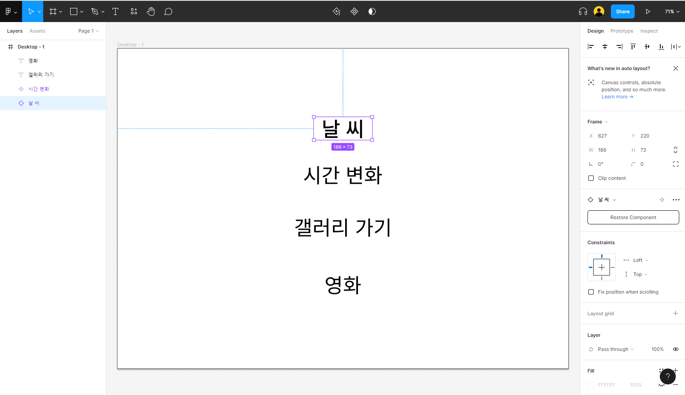

22.07.13 TIL


## I. Jira TIL

#### 	1. Jira?

>  **지라**(JIRA)는 아틀라시안이 개발한 사유 이슈 추적 제품이다. 버그 추적, 이슈 추적, 프로젝트 관리 기능을 제공하는 소프트웨어이다.
>
> ```
> 아틀라시안 코퍼레이션?
> 오스트레일리아의 시드니에 기반을 두고 있으며 소프트웨어 개발자들을 타겟으로 하는 전사적 소프트웨어를 만드는 소프트웨어 기업이다.
> ```


### 	2. 이름의 유래?!

>  **지라**(JIRA)라는 이름은 고지라라는 일본식 이름에서 따왔다.
>
> ```
> 고지라(ゴジラ)는 혼다 이시로 감독의 1954년 영화 고지라에 처음 등장하는 일본의 영화 괴물이자 괴수이다. 그 뒤로 도호사가 28개 영화에 고지라를 등장시키면서 고지라는 전 세계적으로 유명한 캐릭터가 되었다. 이 괴수는 비디오 게임, 소설, 만화책, 텔레비전 시리즈를 포함한 수많은 미디어에 등장하였다. 1998년에는 미국에서 리메이크 판 영화가 나왔고 2014년에도 미국에서 리메이크 판 영화가 나와 상영하였다.
> ```


### 	3. Epic(큰틀), Story(이야기), Task(작업), Bug(버그)를 어떻게 사용하면 좋을지??

- Epic (큰틀) : 여러 스프린트에 걸쳐서 끝나지 않고, 여러 스토리들의 집합
- Story : “{사용자} 로써 {무엇}을 하고싶다” 에 대한 액터의 유즈케이스
- Task : 구현에는 직접적으로 관련이 없는 업무 (문서작성 등)
- Bug : 테스트 엔지니어로부터 버그로 리포팅된 타입


---


## II. Figma TIL

#### 1. Figma?

> Figma란 포토샵, 스케치 대비 반응형 UI 디자인에 최적화된 UI 편집 툴이다.
>
> ```
> #장점
> 쉽고 빠르다.
> 업무 효율성이 좋다.
> 무료로 사용 가능하다 (팀 라이브러리 기능 제외)
> 윈도우, Mac 상관 없이 인터넷이 된다면 UI 편집 가능!
> 실시간 파일 동기화 및 커뮤니케이션
> 웹 & App 개발 협업툴
> 실시간 멀티플레잉 편집기능
> Private Project 기능
> 내부 GUI Code View (== zeplin)
> 프로토타이핑 기능
> 버전 히스토리 기능
> Adaptive Layout 시스템(반응형 UI)
> ```


#### 2. UI 디자인 툴

- 현재 UI 디자인 분야에서는 기존의 포토샵이 아닌 스케치(Sketch), 피그마(Figma), XD와 같은 전용 저작툴이 인기를 끌고 있음.

> 무료 버전
>
> ```
> #Free
> 
> 3 Figma and 3 FigJam files
> Unlimited personal files
> Unlimited collaborators
> Plugins, widgets, and templates
> Mobile app
> ```


#### 3. 사용법 익히기




=> 추후 웹서핑, 독서, 유튜브 등을 통해 각 기능들 학습하기

=> 가능하면 기능들 문서화하기


## III. Git TIL

#### 1. Git Branch 관련 명령어

##### a. 브랜치 확인

```
$ git branch	# master
$ git branch -v
```

> 현재 내가 위치한 Branch 확인


```
$ git branch --merged	# ohohoh *master
$ git branch -v
```

> 이미 Merge한 브랜치 목록을 확인
>
> ohohoh 브랜치는 Merge한 브랜치로 목록에 나타난다. 또 * 기호가 붙어있지 않으므로 `git branch -d` 명령으로 삭제해도 되는 브랜치다.


```
$ git branch --no--merged	# hahaha
```

> 현재 Checkout한 브랜치에 Merge하지 않은 브랜치를 확인
>
> Merge 하지 않은 커밋을 담고 있는 브랜치는 `git branch -d` 명령으로 삭제되지 않음. Merge하지 않은 브랜치를 강제로 삭제하려면 `-D` 옵션으로 삭제


---

##### b. 브랜치 관리

```
$ git branch ohohoh master
```

> 브랜치를 생성
>
> 첫 번째 매개변수는 생성하려는 브랜치명이고 두 번째는 분기해 나올 브랜치명을 입력

##### 

```
$ git branch -D ohohoh
```

> 로컬 브랜치를 삭제

##### 

```
$ git branch -m ohohoh hohoho
```

> 브랜치명을 변경
>
> 첫 번째 매개변수는 기존 브랜치명이고 두 번째는 새로운 브랜치명을 입력

##### 

```
$ git checkout hohoho
```

> hohoho 브랜치로 이동

##### 

```
$ git checkout -b hohoho
```

> 브랜치를 생성하고 생성된 새로운 브랜치로 이동
